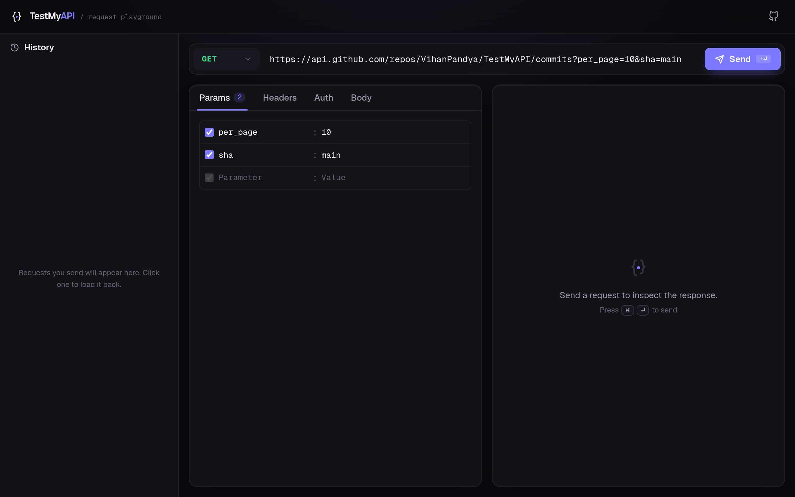
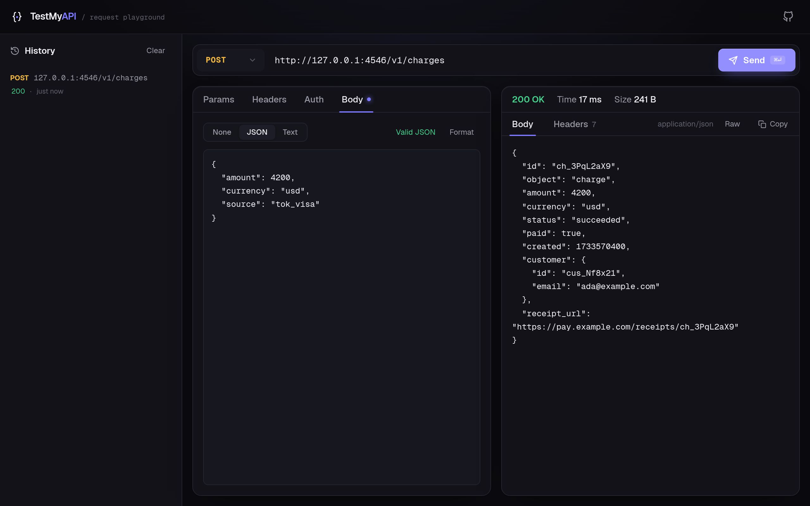

# TestMyAPI

A fast, browser-based playground for testing HTTP APIs. Compose a request —
method, URL, query params, headers, auth and a body — fire it off, and inspect
the response (status, timing, size, headers and a pretty-printed body) without
leaving the page.

Built with Next.js (App Router), TypeScript and Tailwind CSS.

## Screenshots

| Compose a request | Inspect the response |
| :---: | :---: |
| [](docs/screenshots/compose.png) | [](docs/screenshots/response.png) |

<sub>Regenerate with `npm run screenshots` (start the app with `ALLOW_PRIVATE_HOSTS=true` first — see [`scripts/screenshot.mjs`](scripts/screenshot.mjs)).</sub>

## Why a server-side proxy?

A request inspector that runs purely in the browser can't call arbitrary APIs:
the browser's same-origin policy blocks cross-origin responses unless the target
server opts in with CORS headers, which most APIs don't. TestMyAPI forwards each
request through a small server route (`/api/proxy`) so it can reach any
`http`/`https` endpoint and read the full response.

Forwarding arbitrary URLs from the server is also an SSRF risk, so the proxy is
deliberately conservative:

- Only `http` and `https` schemes are allowed.
- The target hostname is resolved and rejected if it points at a private,
  loopback, link-local (incl. `169.254.169.254` cloud metadata), CGNAT or
  otherwise non-public address. Private hosts are blocked in production and
  allowed in development (so you can test `localhost`); override with
  `ALLOW_PRIVATE_HOSTS`.
- Redirects are **not** followed automatically — the `3xx` and its `Location`
  header are surfaced instead, which avoids redirect-based SSRF bypasses.
- Requests time out after 30s and the buffered response body is capped at 5 MB.

## Features

- Methods: GET, POST, PUT, PATCH, DELETE, HEAD, OPTIONS.
- Query params editor that stays in sync with the URL bar.
- Custom request headers.
- Auth helpers: Bearer token and Basic auth.
- JSON / text body with a one-click formatter and live JSON validation.
- Response viewer with pretty/raw toggle, header list, status, time and size.
- Request history (stored locally in your browser) — click to reload a request.
- `⌘/Ctrl + Enter` to send.

## Getting started

Requires Node.js 20+.

```bash
npm install
npm run dev
```

Open http://localhost:3000.

## Scripts

| Command             | Description                     |
| ------------------- | ------------------------------- |
| `npm run dev`       | Start the dev server.           |
| `npm run build`     | Production build.               |
| `npm run start`     | Run the production build.       |
| `npm run lint`      | Lint with ESLint.               |
| `npm run typecheck` | Type-check with `tsc --noEmit`. |
| `npm run test`      | Run the unit tests (Vitest).    |

## Configuration

| Variable              | Default                        | Description                                                                   |
| --------------------- | ------------------------------ | ----------------------------------------------------------------------------- |
| `ALLOW_PRIVATE_HOSTS` | `true` in dev, `false` in prod | `true` lets the proxy reach private/loopback addresses; `false` blocks them.  |

See [`.env.example`](./.env.example).

## Deployment

The app is a standard Next.js project and deploys anywhere Next.js runs. The
`/api/proxy` route needs the Node.js runtime (it performs DNS resolution), so a
fully static export won't work.

- **Vercel:** import the repository and deploy — no extra configuration needed.
  Leave `ALLOW_PRIVATE_HOSTS` unset so private hosts stay blocked in production.
- **Node host / container:** `npm run build` then `npm run start` (listens on
  `PORT`, default 3000).

## Project structure

```
app/
  api/proxy/route.ts   # request validation + the proxy endpoint
  layout.tsx, page.tsx # shell and main playground UI
components/             # request bar, tabs, editors, response view, history
lib/
  proxy.ts             # the forwarding engine (fetch, timeout, size cap)
  ssrf.ts              # URL validation + private-address detection
  request.ts           # request-state model and URL/param helpers
  format.ts            # byte/duration/status/JSON formatting
  storage.ts           # local history persistence
```

## License

MIT — see [LICENSE](./LICENSE).
